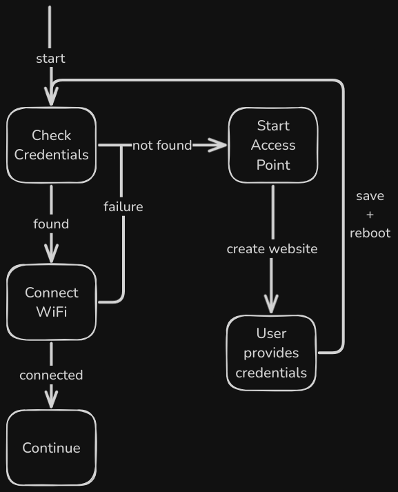

# WiFiManager
Used to enable WiFi access to pico W projects without the need to hardcode credentials. Especially useful for projects that are going to be moving around or for when you don't know the WiFi at build time.

### Installing

#### Manually
Download the `wifimanager.py` file and upload it to your pico with [Thonny](https://thonny.org) or [MicroPico](https://github.com/paulober/MicroPico)

#### mip
TODO: coming soon

### How it works
Tries to load credentials from the `credentials` file. If they are not present or if they are incorrect, it will create an access point in which you can connect and through a webpage, load the credentials to be saved in plaintext.

There is **NO** security or encryption anywhere - use at your own risk!



#### Configuration
You can change the default `ssid` and `password` for the access point and also the `timeout` of how many seconds the manager will wait to connect to WiFi before starting the access point.
```python
# Configure custom credentials and timeout
WiFiManager(
    ssid='YourCustomSSID',
    password='YourCustomPassword', 
    timeout=20 #seconds
)
```

##### Website
The website that the access point creates can modified by changing the `_webpage()` method. You can style it to your preference.

### Contributions

Any contribution to the project is greatly appreciated, just open a PR. 